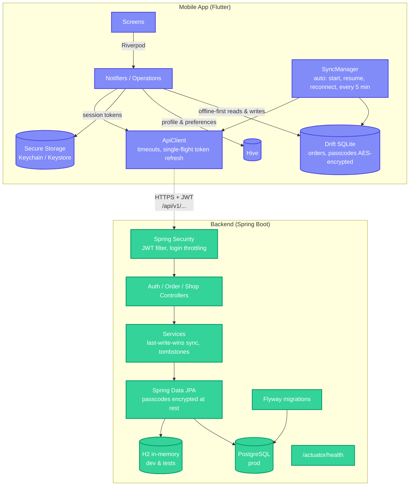

# FixManager — Mobile Repair Shop Management App

FixManager is a lightweight, high-performance, mobile-first shop management application targeted at mobile, laptop, computer, and electronics repair businesses. This repository contains the Phase 1 implementation, featuring:
* **Authentication & Shop Onboarding**: Multi-tenant email login/signup and profile configurations.
* **Repair Order Management**: Multi-section diagnostics, accessories checklist, notifications, and visual pattern drawers.
* **Offline-First Synchronization**: A resilient repository structure that saves data instantly in a local SQLite cache and merges it with the cloud when internet access is restored.

---

## 🛠️ Project Architecture



---

## 🚀 Part 1: Local Development Setup

### Prerequisites
Ensure you have the following installed on your machine:
* **Java 17 Development Kit (JDK)**
* **Apache Maven** (for building the backend)
* **Flutter SDK (3.x.x+)** & **Dart**
* **Android Emulator** or a physical device with USB Debugging enabled

---

### 1. Running the Spring Boot Backend

The backend is located in [`/backend`](backend). By default, it is configured with an **in-memory H2 database** to enable zero-setup execution immediately.

1. Navigate to the backend directory:
   ```bash
   cd "/Users/sharmajidurgesh/Repair Mobile Shop Application/backend"
   ```
2. Build and compile the codebase:
   ```bash
   mvn clean compile
   ```
3. Start the application:
   ```bash
   mvn spring-boot:run
   ```
4. The API will boot up at `http://localhost:8080` using the `dev` profile ([`application-dev.yml`](backend/src/main/resources/application-dev.yml)), which has throwaway keys and an in-memory database.
   * **H2 Database Console** (dev profile only): `http://localhost:8080/h2-console`
     * **JDBC URL**: `jdbc:h2:mem:repairshopdb`
     * **Username**: `sa`
     * **Password**: `sa`
   * **Password reset codes**: without a mail server configured, the 6-digit code is printed in the backend log.
5. Run the test suite:
   ```bash
   mvn test
   ```

---

### 2. Running the Flutter Mobile App

The frontend is located in [`/mobile`](mobile).

1. Navigate to the mobile directory:
   ```bash
   cd "/Users/sharmajidurgesh/Repair Mobile Shop Application/mobile"
   ```
2. Run our **Code-Gen Assistant** to fetch packages and compile the SQLite schema code:
   ```bash
   ./run_codegen.sh
   ```
   *If your shell doesn't have the global `flutter` PATH defined, this script will search common locations or display precise instructions on how to click "Run build_runner" inside VS Code/Android Studio.*
3. Open your Android Emulator or iOS Simulator, or connect a device. Building requires the Android SDK (Android Studio) or Xcode.
4. Launch the application:
   ```bash
   flutter run
   ```
5. **Connection Note**: The API address comes from [`app_config.dart`](mobile/lib/core/config/app_config.dart). By default the Android emulator uses `http://10.0.2.2:8080/api/v1` (your machine's localhost) and the iOS simulator uses `http://localhost:8080/api/v1`. For a physical device, pass your machine's LAN IP without editing code:
   ```bash
   flutter run --dart-define=API_BASE_URL=http://192.168.1.20:8080/api/v1
   ```
6. Run the tests:
   ```bash
   flutter test
   ```

---

## 🗄️ Part 2: Database Setup & Migration

The schema is versioned with **Flyway**: migrations live in [`backend/src/main/resources/db/migration`](backend/src/main/resources/db/migration) and run automatically on startup, against H2 in dev and PostgreSQL in production. Hibernate only validates the schema (`ddl-auto: validate`) and never changes it.

* To change the schema, add a new file such as `V2__add_payment_mode.sql`. Never edit a migration that has already run.

### Using PostgreSQL
Start the backend with the `prod` profile and point it at your database. No file edits are needed:
```bash
export SPRING_PROFILES_ACTIVE=prod
export DATABASE_URL=jdbc:postgresql://localhost:5432/repairshop
export DATABASE_USERNAME=postgres
export DATABASE_PASSWORD=yourpassword
export JWT_SECRET=$(openssl rand -base64 48)
export DEVICE_SECRET_KEY=$(openssl rand -base64 32)
mvn spring-boot:run
```

---

## ☁️ Part 3: Production & Cloud Deployment

See **[DEPLOYMENT.md](DEPLOYMENT.md)** for a step-by-step guide:
* the backend and PostgreSQL on Render, created in one step from [`render.yaml`](render.yaml)
* building the Android APK against your server and installing it on shop phones
* publishing to the Play Store later
* every environment variable explained
